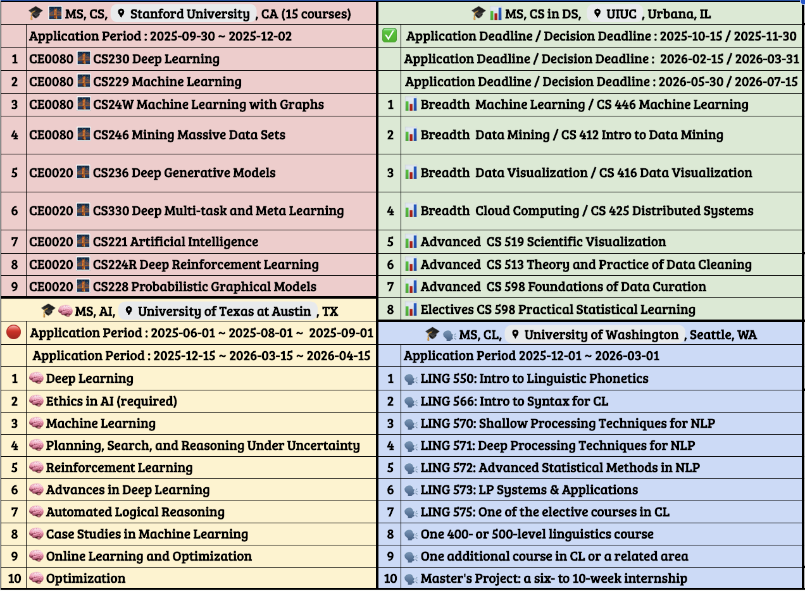
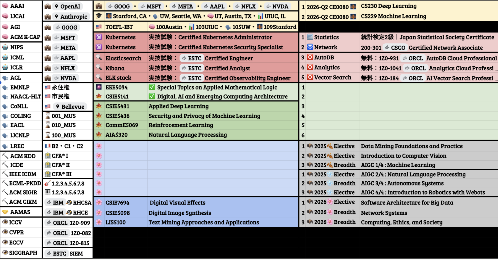

# 📬 Contact Information

| Platform        | Link / Note                                                                                                                                                                          |
|-----------------|---------------------------------------------------------------------------------------------------------------------------------------------------------------------------------------|
| 📄 [Google Sheet](https://docs.google.com/spreadsheets/d/1qFHtR24B5UH7TLq60TdfFSSah3_vxXQ-apWZ8R6ydtY/edit?usp=sharing) | Academic Transcript, Certification, Weekly Schedule in 2025                                                                                                  |
| 📧 Gmail         | [r05921008@gmail.com](mailto:r05921008@gmail.com) If needed, please contact me in either 🇺🇸English or 🇯🇵Japanese. Thank you!                                                 |
| 💻 GitHub        | [goog-msft-fb-nflx-nvda-aapl](https://github.com/goog-msft-fb-nflx-nvda-aapl)                                                                                             |
| 📇 LinkedIn      | [james-goog-jp-ms-cl-uw](https://www.linkedin.com/in/james-goog-jp-ms-cl-uw/)                                                                                        |
| 🏅 Credly        | [james_hnd_2025/badges](https://www.credly.com/users/james_hnd_2025/badges#credly)                                                                                 |
| 📜 CertDirectory | [certdirectory.io/profile](https://certdirectory.io/profile/c83940d1-9bd6-468a-a67f-8dfb49fb4bbf)                                                                                     |
| ▶️ YouTube       | [@goog-msft-fb-nflx-nvda-aapl](https://www.youtube.com/@goog-msft-fb-nflx-nvda-aapl)                                                                                     |
| 🐦 X (Twitter)   | [James_GOOG_CLUW](https://x.com/James_GOOG_CLUW)                                                                                                                               |
| 📸 Instagram     | [instagram.com/james_goog_cluw](https://instagram.com/james_goog_cluw)                                                                                                               |
| 🧵 Threads (inactive)       | [@james_goog_cluw](https://threads.net/@james_goog_cluw)                                                                                                                  |
| 🦋 Bluesky (inactive)       | [james-goog-mscluw.bsky.social](https://bsky.app/profile/james-goog-mscluw.bsky.social)                                                                             |

# Graduate School Application Goals (2025-2026)

## 🎯 Pursuing Excellence in Graduate Studies

I am committed to advancing my academic journey by applying to multiple prestigious Master's programs in the United States. With a strong foundation in computer science, artificial intelligence, and interdisciplinary studies, I am determined to contribute meaningfully to cutting-edge research and innovation in these fields.

## Target M.S. Programs

| University | Program | Application Period | Decision Period |
|------------|---------|-------------------|-----------------|
| 🌉 **Stanford University, CA** | [Computer Science](https://www.cs.stanford.edu/masters-program-overview) | 2025-09-30 ~ 2025-12-02 | |
| 🗣️ **University of Washington, Seattle, WA** | [Computational Linguistics](https://www.compling.uw.edu/) | 2025-12-01 ~ 2026-03-01 | |
| 🧠 **University of Texas at Austin, TX** | [Artificial Intelligence](https://cdso.utexas.edu/msai) |  **🍂Fall Application**  Opens: Dec 15  Priority Deadline:	Mar 15  Final Deadline:	Apr 15 | Late-July to Mid-December |
|  |  |  **🌸Spring Application**  Opens: June 1  Priority Deadline:	Aug 1  Final Deadline:	Sep 1 | Late-January to Mid-July |
| 📊 **UIUC, Urbana, IL** | [C.S. in Data Science](https://siebelschool.illinois.edu/academics/graduate/professional-mcs/online-master-computer-science-data-science) |  2025-10-15 | 2025-11-30 |
|  |  |  2026-02-15 | 2026-03-31 |
|  |  |  2026-05-30 | 2026-07-15 |

---

# Academic Transcript

## [National Taiwan University](https://www.ntu.edu.tw/english/) (NTU)
 -  M.S. in [Electrical Engineering](https://web.ee.ntu.edu.tw/eng/index.php), [College of Eletrical Engineering and Computer Science](https://eecs.ntu.edu.tw/?locale=en)
 -  B.S. in Mechanical Engineering, double major in Mathematics, minor in Electrical Engineering.

---

## National Taiwan University Academic Grading Guide

| Letter Grade | Description                              | GPA | Raw Score Range | Reference Score |
|--------------|-------------------------------------------|-----|------------------|------------------|
| A+           | All goals achieved beyond expectation.    | 4.3 | 90–100          | 95               |
| A            | All goals achieved.                       | 4.0 | 85–89           | 87               |
| A-           | All goals achieved, but need some polish. | 3.7 | 80–84           | 82               |
| B+           | Some goals well achieved.                 | 3.3 | 77–79           | 78               |

---

## Computer Science and Information Engineering (CSIE)

### Foundational Computer Science
| Course Code | Course Title | Grade | GPA | Credits | Instructor |
|-------------|--------------|-------|-----|---------|------------|
| CSIE1920 | Introduction to Computer Science | A+ | 4.3 | 2 | Kun-Mao Chao |
| CSIE1212 | Data Structures and Algorithms | B+ | 3.3 | 3 | Roger Jang |
| CSIE3310 | Operating Systems | B+ | 3.3 | 3 | Tei-Wei Kuo |

### Algorithms & Theory
| Course Code | Course Title | Grade | GPA | Credits | Instructor |
|-------------|--------------|-------|-----|---------|------------|
| CSIE5028 | Algorithms for Biological Sequence Analysis | A+ | 4.3 | 3 | Kun-Mao Chao |
| CSIE7133 | Special Topics on Graph Algorithms | A+ | 4.3 | 3 | Kun-Mao Chao |
| IM3006 | Theory of Computing | A+ | 4.3 | 3 | Tsay, Yih-Kuen |

### Artificial Intelligence & Machine Learning
| Course Code | Course Title | Grade | GPA | Credits | Instructor |
|-------------|--------------|-------|-----|---------|------------|
| CSIE5400 | Artificial Intelligence | A | 4.0 | 3 | Yung-Jen Hsu |
| CSIE7430 | Advanced Deep Learning | A+ | 4.3 | 3 | Vivian Chen |
| EE 5184 | Machine Learning | A- | 3.7 | 4 | Pei-Yuan Wu |
| EE 5200 | Introduction to Generative AI | A+ | 4.3 | 2 | Hung-yi Lee |

### Computer Vision & Image Processing
| Course Code | Course Title | Grade | GPA | Credits | Instructor |
|-------------|--------------|-------|-----|---------|------------|
| CSIE5612 | Digital Image Processing | A+ | 4.3 | 3 | Yi-Ping Hung |
| CSIE5732 | Computer Vision | A+ | 4.3 | 3 | Chiou-Shann Fuh |
| CSIE7421 | Advanced Computer Vision | A+ | 4.3 | 3 | Chiou-Shann Fuh |

### Natural Language Processing & Information Retrieval
| Course Code | Course Title | Grade | GPA | Credits | Instructor |
|-------------|--------------|-------|-----|---------|------------|
| CSIE5042 | Natural Language Processing | A+ | 4.3 | 3 | Hsin-Hsi Chen |
| CSIE5137 | Web Retrieval and Mining | A | 4.0 | 3 | Pu-Jen Cheng |
| Data5014 | Natural Language Processing and Information Retrieval with Applications in Social Networks | A+ | 4.3 | 3 | Huang, Hen-Hsen |

### Computer Networks & Systems
| Course Code | Course Title | Grade | GPA | Credits | Instructor |
|-------------|--------------|-------|-----|---------|------------|
| CSIE5057 | Advanced Computer Network | A+ | 4.3 | 3 | Ai-Chun Pang |
| EE 4039 | Computer Architecture | A- | 3.7 | 3 | Yi-Chang Lu |

### Quantum & Advanced Computing
| Course Code | Course Title | Grade | GPA | Credits | Instructor |
|-------------|--------------|-------|-----|---------|------------|
| CSIE5126 | Computing Architecture for Digital, AI and Quantum Computing | A | 4.0 | 1 | Bor-Sung Liang |
| CSIE5134 | Quantum Computer | A+ | 4.3 | 1 | Cheng-Yuan Liou |

### Big Data & Blockchain
| Course Code | Course Title | Grade | GPA | Credits | Instructor |
|-------------|--------------|-------|-----|---------|------------|
| CSIE5318 | Blockchain and Big Data | A- | 3.7 | 3 | Shih-wei Liao |

---

## Data Science & Statistics

| Course Code | Course Title | Grade | GPA | Credits | Instructor |
|-------------|--------------|-------|-----|---------|------------|
| Data7003 | Seminar | A | 4.0 | 1 | I-Ping Tu |
| HDAS7004 | Statistical and Machine Learning | A | 4.0 | 3 | Charlotte Wang |
| IE5054 | Data Analytics | A | 4.0 | 3 | Jakey BLUE |
| MATH 5063 | Statistical Foundations of Data Science I | A | 4.0 | 3 | Yao, Yi-Ching |
| EPM 8091 | Applied Stochastic Process (2) | A+ | 4.3 | 2 | Chen, Hsiu-Hsi |

---

## Programming & Software Development

| Course Code | Course Title | Grade | GPA | Credits | Instructor |
|-------------|--------------|-------|-----|---------|------------|
| CSX 1004 | Interactive Web Programming | A+ | 4.3 | 1 | Kun Chen |
| CSX 4002 | Computer Programming (Java) | A+ | 4.3 | 1 | Kun Chen |
| CSX 4002 | Computer Programming (Python) | A+ | 4.3 | 1 | Jie-Fan, Chang |
| CSX 3002 | C/C++ Programming | A+ | 4.3 | 1 | Jie-Fan, Chang |
| CSX 0014 | Using R for Data Analysis | A | 4.0 | 1 | Pecu Tsai |
| EE 3011 | Data Structure and Programming | B+ | 3.3 | 3 | Hsu-chun Yen |
| MATH 1402 | Computer Programming | A | 4.0 | 3 | P. Y. Ting |

---

## Mathematical Foundations

| Course Code | Course Title | Grade | GPA | Credits | Instructor |
|-------------|--------------|-------|-----|---------|------------|
| MATH 3604 | Intro. to Computational Mathematics | A | 4.0 | 4 | I-Liang Chern |
| EEE5034 | Special Topics on Applied Mathematical Logic | TBD | TBD | 3 | Jie-Hong Roland Jiang |
| NCTS5009 | Introduction to Parallel Computing (II) | A | 4.0 | 1 | 中島研吾教授, 星野哲也教授 |

---

## University of Colorado Boulder
### Master of Science in Computer Science (In Progress)

---

## University of Colorado Boulder Academic Grading Guide

| Letter Grade | GPA | Percentage Range  |
|--------------|-----|-------------------|
| A            | 4.0 | 94% to 100%       |
| A-           | 3.7 | 90% to <94%       |
| B+           | 3.3 | 87% to <90%       |
| B            | 3.0 | 83% to <87%       |
| B-           | 2.7 | 80% to <83%       |

---

### Algorithms
| Course Code | Course Title | Letter Grade | Credits | Instructor |
|-------------|--------------|--------|---------|------------|
| CSCA 5414 | Dynamic Programming, Greedy Algorithms | A | 1 | Sriram Sankaranarayanan |
| CSCA 5424 | Approximation Algorithms and Linear Programming | A | 1 | Sriram Sankaranarayanan |
| CSCA 5454 | Advanced Data Structures, RSA and Quantum Algorithms | A | 1 | Sriram Sankaranarayanan |

---

### Algorithms
| Course Code | Course Title | Letter Grade | Credits | Instructor |
|-------------|--------------|--------|---------|------------|
| CSCA 5414 | Dynamic Programming, Greedy Algorithms | A | 1 | Sriram Sankaranarayanan |
| CSCA 5424 | Approximation Algorithms and Linear Programming | A | 1 | Sriram Sankaranarayanan |
| CSCA 5454 | Advanced Data Structures, RSA and Quantum Algorithms | A | 1 | Sriram Sankaranarayanan |

---

### Data Mining Foundations and Practice (🍂Fall 2025 / Session 1)
| Course Code | Course Title | Letter Grade | Credits | Instructor |
|-------------|--------------|--------|---------|------------|
| CSCA 5502 | Data Mining Pipeline | TBD | 1 | TBD |
| CSCA 5512 | Data Mining Methods | TBD | 1 | TBD |
| CSCA 5522 | Data Mining Project | TBD | 1 | TBD |

---

### Machine Learning: Theory & Hands-On Practice with Python (🍂Fall 2025 / Session 1)
| Course Code | Course Title | Letter Grade | Credits | Instructor |
|-------------|--------------|--------|---------|------------|
| TBD | Introduction to Machine Learning: Supervised Learning | TBD | 1 | TBD |
| TBD | Unsupervised Algorithms in Machine Learning | TBD | 1 | TBD |
| TBD | Introduction to Deep Learning | TBD | 1 | TBD |

---

### Introduction to Computer Vision (🍂Fall 2025 / Session 1)
| Course Code | Course Title | Letter Grade | Credits | Instructor |
|-------------|--------------|--------|---------|------------|
| TBD | Introduction to Computer Vision | TBD | 1 | TBD |
| TBD | Deep Learning for Computer Vision | TBD | 1 | TBD |
| TBD | Computer Vision for Generative AI | TBD | 1 | TBD |

---

### Introduction to Robotics with Webots (❄️Fall 2025 / Session 2)
| Course Code | Course Title | Letter Grade | Credits | Instructor |
|-------------|--------------|--------|---------|------------|
| TBD | Basic Robotic Behaviors and Odometry | TBD | 1 | TBD |
| TBD | Robotic Mapping and Trajectory Generation | TBD | 1 | TBD |
| TBD | Robotic Path Planning and Task Execution | TBD | 1 | TBD |

---

### Natural Language Processing: Deep Learning Meets Linguistics (❄️Fall 2025 / Session 2)
| Course Code | Course Title | Letter Grade | Credits | Instructor |
|-------------|--------------|--------|---------|------------|
| TBD | Fundamentals of Natural Language Processing | TBD | 1 | TBD |
| TBD | Deep Learning for Natural Language Processing | TBD | 1 | TBD |
| TBD | Model and Error Analysis for Natural Language Processing | TBD | 1 | TBD |

---

### Foundations of Autonomous Systems (❄️Fall 2025 / Session 2)
| Course Code | Course Title | Letter Grade | Credits | Instructor |
|-------------|--------------|--------|---------|------------|
| TBD | Modeling of Autonomous Systems | TBD | 1 | TBD |
| TBD | Requirement Specifications for Autonomous Systems | TBD | 1 | TBD |
| TBD | Verification and Synthesis of Autonomous Systems | TBD | 1 | TBD |

---

### Computing, Ethics, and Society (🌸Spring 2026 / Session 1)
| Course Code | Course Title | Letter Grade | Credits | Instructor |
|-------------|--------------|--------|---------|------------|
| TBD | Computing, Ethics, and Society Foundations | TBD | 1 | TBD |
| TBD | Ethical Issues in AI and Professional Ethics | TBD | 1 | TBD |
| TBD | Ethical Issues in Computing Applications | TBD | 1 | TBD |

---

### Software Architecture for Big Data (🌸Spring 2026 / Session 1)
| Course Code | Course Title | Letter Grade | Credits | Instructor |
|-------------|--------------|--------|---------|------------|
| TBD | Fundamentals of Software Architecture for Big Data | TBD | 1 | TBD |
| TBD | Software Architecture Patterns for Big Data | TBD | 1 | TBD |
| TBD | Applications of Software Architecture for Big Data | TBD | 1 | TBD |

---

### Network Systems: Principles and Practice (Linux and Cloud Networking) (🌸Spring 2026 / Session 1)
| Course Code | Course Title | Letter Grade | Credits | Instructor |
|-------------|--------------|--------|---------|------------|
| TBD | Network Systems Foundation | TBD | 1 | TBD |
| TBD | Network Principles in Practice: Linux Networking | TBD | 1 | TBD |
| TBD | Network Principles in Practice: Cloud Networking | TBD | 1 | TBD |

---

**Key Dates:**
- 🍂 Fall 2025 Session 1: Grades reflected on transcript October 29, 2025
- ❄️ Fall 2025 Session 2: Grades reflected on transcript January 3, 2026  
- 🌸 Spring 2026 Session 1: Grades reflected on transcript March 18, 2026
- **Degree Conferral: March 27, 2026**

**Total Credits:** 30 (3 completed + 27 upcoming)

---

# Quotes
 - 🇯🇵 出来ないのは、周りが悪いんじゃない 自分がいけないんだ 嫌だったら自分で変えなきゃ。
 - 🇬🇧 "Success is not final, failure is not fatal: it is the courage to continue that counts."
 - 🇩🇪 "Sein Leben schwingt also, gleich einem Pendel, hin und her, zwischen dem Schmerz und der Langenweile, welche beide in der That dessen letzte Bestandteile sind.", 《Die Welt als Wille und Vorstellung》, [Arthur Schopenhauer](https://en.wikipedia.org/wiki/Arthur_Schopenhauer)
 - 🇫🇷 "Il n'y a qu'un problème philosophique vraiment sérieux : c'est le suicide", 《Le Mythe de Sisyphe》, [Albert Camus](https://en.wikipedia.org/wiki/Albert_Camus)
 - 🇪🇸 "y que en cualquier lugar en que estuvieran recordaran siempre que el pasado era mentira, que la memoria no tenía caminos de regreso, que toda primavera antigua era irrecuperable, y que el amor más desatinado y tenaz era de todos modos una verdad efímera.", 《Cien años de soledad》, [Gabriel García Márquez](https://en.wikipedia.org/wiki/Gabriel_Garc%C3%ADa_M%C3%A1rquez)

---

*Last Updated: August 2025*
